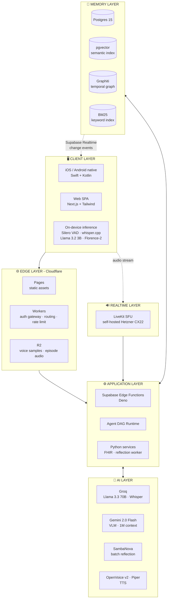
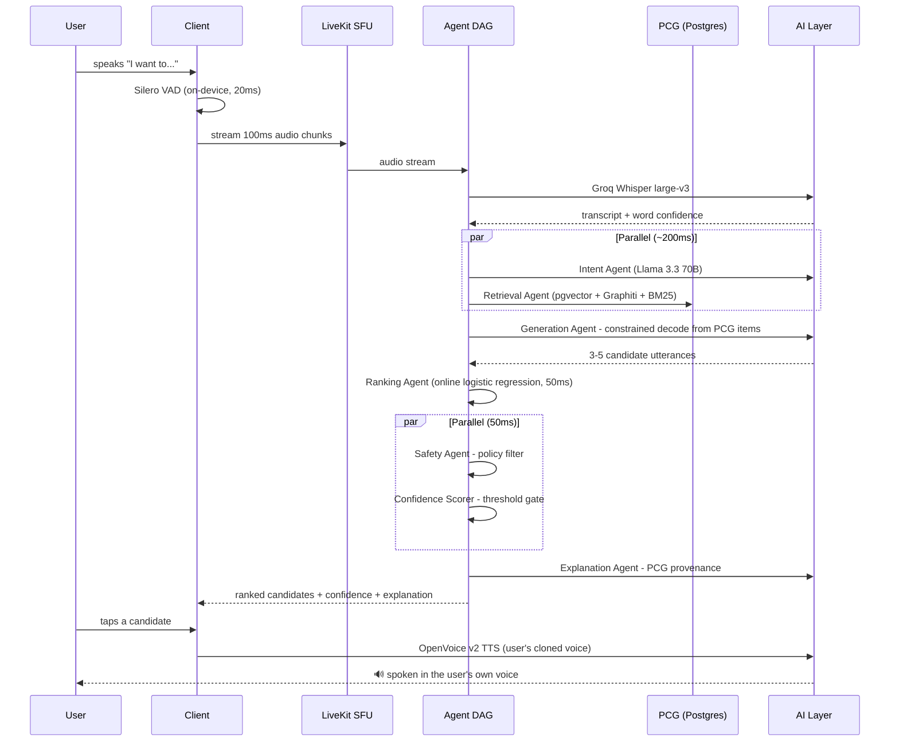
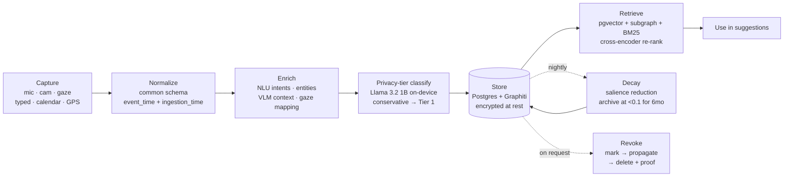
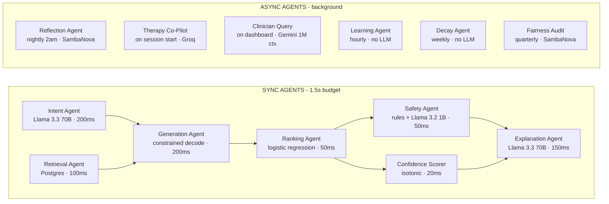

# HalfSaid

**A Personal Communication Intelligence Platform for people with aphasia and related communication disorders.**

Not "AI that finishes sentences." A continuously learning **Personal Communication Graph (PCG)** - clinic-native, free-tier-sustainable, explainable by construction.

[]()
[]()
[]()
[]()

---

## Table of Contents

1. [Team](#1-team)
2. [Problem Statement](#2-problem-statement)
3. [Our Solution](#3-our-solution)
4. [Features](#4-features)
5. [Tech Stack](#5-tech-stack)
6. [System Architecture](#6-system-architecture)
7. [Detailed Workflow](#7-detailed-workflow)
8. [Folder Structure](#8-folder-structure)
9. [Installation & Usage](#9-installation--usage)
10. [API & Database Documentation](#10-api--database-documentation)
11. [AI/ML Workflow](#11-aiml-workflow)
12. [Hardware](#12-hardware)
13. [Security Measures](#13-security-measures)
14. [Testing & Performance](#14-testing--performance)
15. [Challenges Faced](#15-challenges-faced)
16. [Future Scope](#16-future-scope)
17. [Demo](#17-demo)
18. [References](#18-references)

---

## 1. Team

**Project:** HalfSaid - Personal Communication Intelligence Platform
**Organisation:** EdenCORP
**Document basis:** HalfSaid PRD v1.0 (41 chapters + 6 appendices, synthesised from 8 research dossiers, ~3,500 lines, ~500 citations)

| Name | Role | Responsibilities |
|---|---|---|
| Sam Adrian | Team Lead / Product | PRD ownership, clinical liaison, roadmap | 
| TamilSelvan | Backend / Data | PCG schema, Supabase, retrieval, migrations | 
| Surya RM | AI/ML | ASR, constrained decoding, ranking, safety agents | 
| Sharan | Frontend / Accessibility | Conversation Canvas, Adaptive UI, WCAG conformance | 
| Rahul Kaushik | Infrastructure | Cloudflare, Hetzner, CI/CD, observability | 
| Lokeshwaran | Research & Development | Project validation and research | 


---

## 2. Problem Statement

The systems meant to help people with acquired communication disorders are fragmented, generic, and clinically disconnected - and the clinicians who could integrate them lack the tools, time, and infrastructure to do so.

### The numbers

| Metric | Value | Source |
|---|---|---|
| Americans living with aphasia | 2M+ | NAA, NIDCD |
| Strokes resulting in aphasia | 25–50% | StatPearls 2024 |
| US SLP facilities reporting more openings than seekers | 55.5% | ASHA 2025 SLP Health Care Survey (n=2,693) |
| Mean SLP productivity target (billable time) | 76% | ASHA 2025 |
| Home exercise adherence, real-world | 30–50% (vs 80%+ in trials) | Brady et al., Cochrane 2024 |
| Speech-generating device cost | $8,000–$15,000 | - |
| SGD procurement time | 12–18 months | - |
| SGD abandonment rate | >30% | - |
| Addressable US prevalence (all conditions) | 16M+ | Aggregated |
| Estimated global TAM (patients + caregivers) | $13.5B | Aggregated |

### Why existing options fail

| Category | Example | Failure mode |
|---|---|---|
| Speech-generating devices | Tobii Dynavox, Lingraphica | Expensive, slow to procure, high abandonment |
| Consumer AI assistants | Siri, Gemini Live, ChatGPT Voice | Assume fluent speech; ignore clinical workflow |
| Clinical AAC software | TD Snap, Proloquo | Symbol/phrase-based, not personalised, not EHR-integrated |
| Voice banking tools | ModelTalker, Acapela, SpeakUnique | One-time recording session, no lifetime stewardship |

---

## 3. Our Solution

HalfSaid constructs, maintains, and reasons over a **Personal Communication Graph (PCG)** - a bi-temporal, multimodal knowledge structure modelling *who the user is, who they talk to, what they say, when, why, and in what language* - and uses that graph to generate communication assistance that is **recognisably theirs**.

The PCG is to personal communication what the social graph is to social media - except it is owned by the user, not a platform, and it is clinically actionable, not advertising-targetable.

### What HalfSaid is - and is not

| HalfSaid **IS** | HalfSaid **IS NOT** |
|---|---|
| A continuously learning Personal Communication Graph | A sentence-completion autocomplete |
| Clinic-native: SMART on FHIR, CPT-aligned, GPO-distributed | A consumer app that bypasses SLPs |
| Constrained-decoded from PCG items only | A generative chatbot that speaks "for" the user |
| Multimodal: speech, vision, gaze, typed, contextual signals | A speech-to-text / text-to-speech utility |
| Multilingual with cross-language semantic reasoning | A translation app |
| A deepfake tool |
| Free-tier sustainable (≈50 users per Supabase free project) | A cloud-AI-heavy product that cannot exist on free tiers |

### The moat

The PCG is a durable, portable, bi-temporal representation of the user's communication identity that **improves every day the user is in the system**, follows them from acute rehab through chronic maintenance, and becomes more valuable to clinicians, family, and the user the longer it exists.

---

## 4. Features

### 4.1 Core concepts (the cognitive infrastructure)

| Concept | What it does |
|---|---|
| **Personal Communication Graph (PCG)** | Bi-temporal, multimodal knowledge graph of the user's communication identity |
| **Communication DNA** | 5-dimension fingerprint of *how* the user speaks: vocabulary, syntax, prosody, pragmatics, multilingual patterns |
| **Context Fusion** | Fuses audio, vision, gaze, calendar, location, history into a 1024-d context vector |
| **Memory Timeline** | User-navigable temporal view of the PCG - transparency + retrieval + revocation surface |
| **Conversation Graph** | Sub-graph of turn-taking, topic chains, repair sequences, communicative outcome |
| **Relationship Intelligence** | Models who the user talks to, how often, about what, in what language, at what emotional valence |
| **Predictive Context** | Predicts likely next communication from routine + calendar + location + time-of-day. *Always offered, never executed.* |
| **Conversation Personas** | User-defined profiles ("Teacher", "Mom", "Patient") each with its own DNA slice and confidence thresholds |
| **Routine Intelligence** | Learns recurring patterns; routine resumption is a clinical outcome measure |
| **Temporal Intelligence** | Reasons about anniversaries, appointments, recovery milestones |
| **Explainability Layer** | Every suggestion cites the PCG nodes/edges it came from - provenance, not chain-of-thought |
| **Adaptive UI** | Adjusts density, font size, contrast, suggestion count, modality to real-time cognitive load and fatigue |
| **Care Circle** | Multi-stakeholder surface (family, SLP, neurologist) governed by per-person, per-data-type consent |
| **Therapy Mode vs Assist Mode** | SLP-directed protocol delivery vs user-directed daily assistance, under different safety regimes |
| **Safety Layer** | Constrained decoding, confidence thresholding, high-stakes hard-block, emergency detection, bias guards |
| **Adaptive Ranking** | Multi-objective ranking (relevance × personal-voice × safety × recency × variety) learned per user |

### 4.2 Expanded capabilities

| # | Capability | Summary |
|---|---|---|
| 1 | **Voice Banking Vault** | Lifetime voice stewardship with progressive-disease adaptation and posthumous governance |
| 2 | **Conversational Replay Studio** | SLP scrubs past episodes with transcript, suggestions, accept/reject, and PCG queries side by side |
| 3 | **Communication Will** | User-directed disposition of PCG, voice data, and history after death or loss of capacity |
| 4 | **Family Council Mode** | Multi-stakeholder approval quorum for high-stakes suggestions |
| 5 | **Recovery Gradient** | Non-judgmental longitudinal view of the user's own trajectory (no demoralising "expected" curves) |
| 6 | **Cohort Insights** | Opt-in anonymised clinical benchmarking; k-anonymity k≥20, differential privacy ε≤1.0 |
| 7 | **Therapy Session Co-Pilot** | Live in-session SLP assist: PCG-derived scripts, real-time scoring, cue surfacing |
| 8 | **Suggestion Sandbox** | Clinician-curated Tier 3 phrase library that bypasses constrained decoding (pre-approved) |
| 9 | **Prosody Mirroring** | Makes Melodic Intonation Therapy home practice feasible: singing TTS, pitch-contour feedback, haptic cueing |
| 10 | **Multilingual Code-Switch Engine** | Real-time code-switch detection, cross-language semantic equivalence, per-listener language selection |
| 11 | **PCG Inheritance** | Consented transfer of the graph to a family member or research archive |
| 12 | **Voice Authenticity Watermark** | Inaudible, tamper-resistant watermark + public Verification API |
| 13 | **Emergency Vocabulary Escalation** | Always-available Tier 3 partition, reachable even offline or under cognitive overload |
| 14 | **Communication Patterns Audit** | Quarterly debias report surfacing the system's own biases to user and SLP |

### 4.3 Federated privacy-preserving PCG learning ✅ *(implemented)*

Clinics collaboratively improve the shared **communication model** (the adaptive
ranker) — so a phrasing pattern one clinic's patients respond to helps everyone —
**without any patient's raw communication data or PCG ever leaving the clinic.**

```
each clinic (local, never leaves):   local step on its own accept/reject feedback → Δw
   → clip to ‖Δw‖₂ ≤ C   (bound sensitivity)
   → + Gaussian DP noise  (ε, δ)      ← differential privacy
   → + pairwise masks     (cancel in the sum)   ← secure aggregation
   ══ transmit the masked, noised Δw only ═══════════════════════════════════►
aggregator:  mean(masked Δw) == mean(true Δw)   → apply to global model (Safety pinned)
```

- **No raw data leaves.** Only a masked weight delta is sent; the wire type carries no
  utterances, features, or PCG. There is **no endpoint that accepts raw feedback**.
- **Secure aggregation.** Pairwise masks sum to zero → the server recovers the *mean*
  update and never sees any single clinic's contribution.
- **Differential privacy.** Gradient clipping + the Gaussian mechanism give **(ε,
  δ)-DP per round**, tracked by a privacy-budget ledger.
- **Safety stays pinned.** The Safety feature (learning-rate 0) can't drift through
  federation — the same hard constraint as the single-user ranker.

Code: [`packages/federated`](packages/federated) · API: `GET /v1/federated/model`,
`POST /v1/federated/aggregate` · Store: `supabase/migrations/0003_federated.sql`
(aggregate model only). Full design + threat model in [SPEC §18](docs/SPEC.md#18-federated-privacy-preserving-pcg-learning-feature).

```bash
# current global model
curl localhost:3000/api/v1/federated/model
# aggregate three clinics' MASKED deltas into a new round (no raw data)
curl -X POST localhost:3000/api/v1/federated/aggregate -H 'content-type: application/json' \
  -d '{"updates":[{"clinicId":"brooks","maskedDelta":[0.3,0.1,0.7,0.05,0.02,0.01],"sampleCount":40},
                   {"clinicId":"kessler","maskedDelta":[0.1,0.05,-0.7,0.03,0.01,0.02],"sampleCount":35},
                   {"clinicId":"shirley","maskedDelta":[0.2,-0.05,0.0,0.02,-0.01,0.0],"sampleCount":28}],
       "dp":{"epsilon":1.0,"delta":1e-5}}'
```

### 4.4 Demo experience — the gap-closure pass ✅ *(implemented)*

All 15 enhancements from the external gap analysis, closed
(full status table in [SPEC §19](docs/SPEC.md#19-gap-closure-pass-2026-07-25-gap-analysis--improvement-review)):

- **Real semantic retrieval** — `gemini-embedding-001` (1024-d) embeds the seed, every
  query, and every new utterance at ingest. Verified live: *"phone my daughter"* →
  *"Call my daughter."* at **0.983 cosine** with zero shared words. The PCG moat is
  measurable, not a slide.
- **The graph made visible** — a zero-dependency force-directed **PCG mini-map**
  (canvas, hub-ranked, typed colors, hover, screen-reader summary) on the Canvas and
  the clinician dashboard, plus a **live node/edge counter** that pulses as the graph
  learns from each utterance.
- **Dignity First, operationalized** — accepting a suggestion speaks immediately but
  persists only after a **5-second undo window**; undo cancels speech and saves
  nothing.
- **High-stakes detection** — medication / legal / financial / consent topics are
  detected from the text itself: free generation is blocked, only clinician-approved
  (Tier 3) phrases surface, and the UI shows a shield explaining why.
- **Natural voice input** — live interim transcript while speaking + silence-based
  auto-stop (VAD), so the mic needs one tap, not two.
- **Two personas** — Maya (Broca's aphasia) and David (ALS) are separate RLS-scoped
  graphs; switching visibly changes every suggestion, log, and map.
- **Clinic-native proof** — LIVE session stats beside the clearly-MOCK FCM chart,
  searchable/paginated conversation log, and a print-optimized **PDF session report**.
- **Demo-day polish** — 4-step guided tour, teach-a-new-phrase refusal exit,
  keyboard shortcuts (1–5 / M / Esc), long-press-to-edit, staggered card animations,
  landing stat strip, and global error boundaries.
- **Hybrid suggestions** — the graph's own phrases are first-class cards blended
  with LLM sentences: a strong PCG match ("Call my daughter" → *"call Sarah"*)
  always leads; the LLM fills in fluent alternatives, de-duplicated.
- **Teach HalfSaid (`/ingest`)** — a chat-only companion: tell it about the
  person's life and every message becomes graph material (nodes + edges +
  embeddings), with entity chips showing exactly what was added and the mini-map
  updating live. A fact you teach is suggestible seconds later.

## 5. Tech Stack

### 5.1 Infrastructure

| Layer | Technology | License | Free-tier limit |
|---|---|---|---|
| Edge (assets) | Cloudflare Pages | Proprietary (free) | Unlimited bandwidth |
| Edge (compute) | Cloudflare Workers | Proprietary (free) | 100K req/day |
| Object storage | Cloudflare R2 | Proprietary (free) | 10GB, no egress fees |
| Database + vectors | Supabase Postgres 15 + pgvector | Apache 2.0 | 500MB DB, 5GB egress |
| Auth | Supabase Auth | Apache 2.0 | 50K MAU |
| Realtime | Supabase Realtime | Apache 2.0 | Included |
| Temporal graph | Graphiti on Postgres | Apache 2.0 | Runs on Supabase |
| Serverless functions | Supabase Edge Functions (Deno) | Apache 2.0 | 500K invocations/mo |
| Streaming audio (SFU) | LiveKit, self-hosted on Hetzner CX22 | Apache 2.0 | Unlimited (~€4.50/mo VPS) |
| CI/CD | GitHub Actions | Free (public repos) | 2K min/mo private |
| Container registry | GitHub Container Registry | Free (public) | Unlimited |
| IaC | OpenTofu | MPL 2.0 | Unlimited |

### 5.2 AI/ML

| Role | Primary | Fallback | License |
|---|---|---|---|
| LLM (primary) | Groq Llama 3.3 70B | Gemini 2.0 Flash → SambaNova → on-device | Llama Community |
| LLM (long context) | Gemini 2.0 Flash (1M tokens) | Groq Llama 3.3 70B | Gemini API ToS |
| LLM (high volume) | SambaNova free tier (20M tokens/day) | - | Apache 2.0 models |
| LLM (local) | Ollama Llama 3.2 3B on device | - | Llama Community |
| ASR | Groq Whisper large-v3 | whisper.cpp (small, on-device) | MIT |
| VAD | Silero VAD (on-device) | Energy-based VAD | MIT |
| Diarization | pyannote.audio (on-device) | Single-speaker assumption | MIT |
| VLM | Gemini 2.0 Flash | Florence-2 (770M, on-device) | MIT |
| OCR | PaddleOCR (local) | - | Apache 2.0 |
| TTS (cross-lingual) | OpenVoice v2 | Kokoro-82M | MIT / Apache 2.0 |
| TTS (on-device) | Piper (subprocess-isolated) | - | GPL-3.0 |
| Translation | LLM-based (Gemini/Groq) | Opus-MT | CC-BY 4.0 |
| Ranking | Online logistic regression | Default weights | - |
| Calibration | Isotonic regression + Platt scaling | Cross-encoder score | - |

### 5.3 Observability

| Signal | Tool | Free tier | Retention |
|---|---|---|---|
| Application logs | Grafana Cloud | 50GB | 30 days |
| Metrics | Grafana Cloud | 10K series | 30 days |
| Traces | Grafana Cloud + OpenTelemetry | 50GB | 7 days |
| Errors | Sentry | 5K errors/mo | 90 days |
| Product analytics | PostHog Cloud | 1M events/mo | Unlimited (raw) |
| Uptime | Better Stack | 10 monitors | Unlimited |

### 5.4 License audit - deliberately excluded

Every dependency is license-audited in CI. The following look free but are **not commercially usable** and are excluded by policy:

| Technology | License | Replacement |
|---|---|---|
| Neo4j Community | GPLv3 (viral) | Graphiti on Postgres (Apache 2.0) |
| Plausible Analytics | AGPL-3.0 (network copyleft) | PostHog (MIT) |
| XTTS v2 (Coqui) | CPML - non-commercial | OpenVoice v2 (MIT) |
| NLLB-200 (Meta) | CC-BY-NC 4.0 | LLM-based translation |
| Seamless M4T v2 (Meta) | CC-BY-NC 4.0 | LLM-based translation |
| Terraform ≥1.6 | BSL 1.1 | OpenTofu (MPL 2.0) |
| Vercel Hobby | Prohibits commercial use | Cloudflare Pages + Workers |
| Edge TTS (Microsoft) | Unofficial API | Piper / Kokoro |

*Piper is GPL-3.0 and is run as a **subprocess**, never linked as a library, to avoid copyleft propagation.*

---

## 6. System Architecture

### 6.1 Six-layer overview



### 6.2 Layer responsibilities and latency budgets

| Layer | Responsibility | Primary tech | Latency budget |
|---|---|---|---|
| Client | UI, capture (mic/cam/gaze), local inference | Swift / Kotlin / Next.js | Touch → 16ms frame; voice → 50ms VAD |
| Edge | Auth gateway, routing, rate limiting, static assets | Cloudflare Workers + Pages | <50ms added |
| Realtime | Audio/video stream relay (SFU) | LiveKit (Hetzner) | <150ms RTT |
| Application | Business logic, agent orchestration, FHIR | Supabase Edge Functions + Python | <200ms per call |
| Memory | PCG storage, vector index, graph, episodic store | Postgres + pgvector + Graphiti | <100ms query |
| AI | ASR, LLM, VLM, TTS | Groq + Gemini + SambaNova + on-device | Varies |

### 6.3 Ten key architectural decisions

| # | Decision | Rationale | Alternatives rejected |
|---|---|---|---|
| 1 | Postgres + pgvector + Graphiti over Neo4j | Apache 2.0; GPLv3 risk avoided; one DB to operate | Neo4j Community (GPLv3), Memgraph (BSL) |
| 2 | Self-hosted LiveKit over LiveKit Cloud | Cloud free tier covers ~1 user; Hetzner CX22 supports ~50 | Daily.co, Ably |
| 3 | Groq as primary LLM over OpenAI | Free tier; Llama 3.3 70B sufficient; lower latency | OpenAI, Anthropic, Together AI |
| 4 | Constrained decoding over free-form generation | Hallucination harm is an existential risk | GPT-4o free-form + prompt engineering |
| 5 | RAG over fine-tuning for personalisation | Catastrophic forgetting risk; instant revocation; cheaper | Per-user LoRA adapters (V2+, opt-in) |
| 6 | On-device SLM for offline + privacy | Cellular dead zones in rehab centres; PHI stays local | Cloud-only |
| 7 | Supabase over Firebase | Postgres not proprietary; 50K MAU; native pgvector | Firebase, Appwrite, PocketBase |
| 8 | Cloudflare Pages over Vercel | Vercel Hobby prohibits commercial use | Vercel, Netlify, Render |
| 9 | OpenVoice v2 over XTTS v2 | MIT vs non-commercial CPML; cross-lingual | XTTS v2, ElevenLabs |
| 10 | Swift/Kotlin native over React Native | Eye-gaze, low-latency audio, Watch biometrics need native APIs | React Native, Flutter |

### 6.4 Acknowledged tradeoffs

- **Self-hosted LiveKit** increases ops burden → mitigated by runbook, monitoring, automatic failover to LiveKit Cloud paid tier.
- **Constrained decoding** limits suggestion variety; the system will sometimes refuse → mitigated by aggressive PCG seeding at onboarding and "ask your SLP to add this" gap surfacing.
- **On-device SLM** needs ~3GB storage → mitigated by lazy download and an optional "lite" mode.

---

## 7. Detailed Workflow

### 7.1 Path 1 - Realtime Conversation Assist (sync, <1.5s budget)



**Critical path:** Intent + Retrieval (parallel, ~200ms) → Generation (200ms) → Ranking (50ms) → Safety/Confidence (parallel, 50ms) → Explanation (150ms) ≈ **650ms of agent compute**, plus ASR (~500ms) and TTS (~300ms) = **~1.45s total**, inside the 1.5s budget.

### 7.2 Path 2 - Therapy Session (sync, SLP-driven)

SLP opens Therapy Mode → application loads the user's PCG + protocol → SLP selects an exercise → user produces an utterance → ASR transcribes → Therapy Co-Pilot Agent scores accuracy, fluency, and prosody → SLP sees live scores → at session end, data writes to the PCG **and** to Epic via SMART on FHIR → a home exercise program is generated from the weak items.

### 7.3 Path 3 - Async Reflection (nightly, ~2h/user)

At 2am user-local, the Hetzner worker VM loads the past 24 hours of episodes → the Reflection Agent (Llama 3.3 70B via SambaNova) synthesises them into PCG edges (new relationships, routines, topics) → Communication DNA is updated → memory decay is applied (low-salience episodes archived) → a reflection summary is written for the SLP's morning review → alerts fire if patterns suggest clinical attention.

### 7.4 Path 4 - Clinician Query (sync, <5s budget)

SLP opens the dashboard → aggregated PCG stats are queried (FCM trends, vocabulary growth, recent episodes) → the Clinician Query Agent uses Gemini 2.0 Flash's 1M-token context for longitudinal questions → natural-language questions ("show me Maya's paraphasias this week") are routed through the agent, which generates a SQL/graph query plan.

### 7.5 PCG lifecycle



---

## 8. Folder Structure

```
halfsaid/
├── apps/
│   ├── web/                          # Next.js SPA → Cloudflare Pages
│   │   ├── app/
│   │   │   ├── canvas/               # Screen 1 - Conversation Canvas (primary)
│   │   │   ├── timeline/             # Screen 2 - Memory Timeline
│   │   │   ├── vault/                # Voice Banking Vault
│   │   │   ├── care-circle/          # Family / caregiver portal
│   │   │   ├── clinician/            # SLP dashboard, Replay Studio, Sandbox
│   │   │   └── recovery/             # Recovery Dashboard & Gradient
│   │   ├── components/
│   │   │   ├── adaptive-ui/          # Profile → State → Rules → Render
│   │   │   ├── suggestion-card/      # Confidence bar, source tag, gestures
│   │   │   └── emergency/            # Always-available vocabulary partition
│   │   ├── lib/
│   │   │   ├── supabase/             # Typed client, RLS-aware queries
│   │   │   ├── livekit/              # SFU client, VAD hooks
│   │   │   └── a11y/                 # Focus management, ARIA, contrast
│   │   └── tests/                    # Jest + Playwright + axe-core
│   ├── ios/                          # Swift - eye-gaze, Watch biometrics
│   └── android/                      # Kotlin
│
├── services/
│   ├── agents/                       # Agent DAG runtime (Python)
│   │   ├── runtime/                  # DAG scheduler, parallel nodes, timeouts
│   │   ├── sync/
│   │   │   ├── intent_agent.py
│   │   │   ├── retrieval_agent.py
│   │   │   ├── generation_agent.py   # ⚠️ constrained decoding ONLY
│   │   │   ├── ranking_agent.py
│   │   │   ├── safety_agent.py
│   │   │   ├── confidence_scorer.py
│   │   │   └── explanation_agent.py
│   │   ├── async/
│   │   │   ├── reflection_agent.py   # nightly 2am user-local
│   │   │   ├── therapy_copilot.py
│   │   │   ├── clinician_query.py
│   │   │   ├── learning_agent.py     # hourly ranker updates
│   │   │   ├── decay_agent.py        # weekly salience decay
│   │   │   └── fairness_audit.py     # quarterly bias report
│   │   └── fallback/                 # Per-agent degradation chains
│   │
│   ├── pcg/                          # Personal Communication Graph
│   │   ├── schema/                   # 11 node types, 15 edge types
│   │   ├── bitemporal/               # event_time / ingestion_time, supersede
│   │   ├── retrieval/                # hybrid: vector + subgraph + BM25
│   │   ├── privacy_tiers/            # Tier 0–3 classification + enforcement
│   │   └── revocation/               # 3-step delete + cryptographic proof
│   │
│   ├── multimodal/
│   │   ├── speech/                   # VAD → ASR → diarization → paraphasia
│   │   ├── vision/                   # Florence-2 on-device, Gemini opt-in
│   │   ├── text/                     # autocomplete, spell, symbol prediction
│   │   └── fusion/                   # 1024-d Context Vector transformer
│   │
│   ├── voice/                        # Voice Banking Vault
│   │   ├── cloning/                  # OpenVoice v2, Kokoro, Piper subprocess
│   │   ├── watermark/                # Spread-spectrum embed + detect
│   │   ├── consent_chain/            # Signed ledger, scopes, revocation
│   │   └── verification_api/         # Public third-party auth endpoint
│   │
│   ├── fhir/                         # SMART on FHIR - Epic, Cerner
│   │   ├── resources/                # Patient, Encounter, Observation
│   │   └── oauth/                    # SMART App Launch v2.2
│   │
│   └── worker/                       # Hetzner VM - reflection + LiveKit
│
├── packages/
│   ├── shared-types/                 # PCG types shared web ↔ native ↔ services
│   ├── safety-policy/                # Hard rules as code - CI-enforced
│   └── ui-tokens/                    # WCAG-audited design tokens
│
├── supabase/
│   ├── migrations/                   # Versioned - source of truth for schema
│   ├── functions/                    # Deno edge functions
│   └── seed/                         # 200-node demo PCG (Maya persona)
│
├── infra/
│   ├── tofu/                         # OpenTofu - Cloudflare, Hetzner, Supabase
│   ├── livekit/                      # SFU config + runbook
│   └── docker/                       # Local dev compose
│
├── ml/
│   ├── adapters/                     # Whisper LoRA - AphasiaBank, UASpeech, Euphonia
│   ├── classifiers/                  # Paraphasia, privacy-tier, intent
│   ├── ranker/                       # Online logistic regression + calibration
│   └── evals/                        # Per-agent metric harnesses
│
├── tests/
│   ├── load/                         # k6 scenarios
│   ├── e2e/                          # Playwright critical paths
│   └── safety/                       # Hallucination + high-stakes block suites
│
├── docs/
│   ├── PRD_v1.0.pdf
│   ├── architecture/
│   ├── runbooks/
│   └── trust-center/                 # Published SLOs, bias reports
│
├── .github/workflows/                # Lint, test, a11y, security, license, deploy
└── README.md
```

---

## 9. Installation & Usage

### 9.1 Prerequisites

| Requirement | Version | Notes |
|---|---|---|
| Node.js | ≥20 LTS | Web app |
| Python | ≥3.11 | Agent services |
| Docker + Compose | latest | Local Supabase + LiveKit |
| Supabase CLI | latest | Migrations, local stack |
| OpenTofu | ≥1.6 | Infrastructure (deploy only) |
| Ollama | latest | Optional - on-device LLM fallback |

### 9.2 Accounts and API keys (all free tier)

| Service | Purpose | Sign-up |
|---|---|---|
| Supabase | Postgres, auth, realtime, edge functions | supabase.com |
| Cloudflare | Pages, Workers, R2 | cloudflare.com |
| Groq | Whisper ASR + Llama 3.3 70B | console.groq.com |
| Google AI Studio | Gemini 2.0 Flash (LLM + VLM) | ai.google.dev |
| SambaNova | Batch reflection jobs | developers.sambanova.ai |
| Hetzner | CX22 VPS for LiveKit (~€4.50/mo) | hetzner.com |

### 9.3 Local setup

```bash
# 1. Clone
git clone https://github.com/<org>/halfsaid.git
cd halfsaid

# 2. Install
npm install                      # workspace root - apps + packages
pip install -r services/requirements.txt

# 3. Environment
cp .env.example .env.local
#   Fill in: SUPABASE_URL, SUPABASE_ANON_KEY, SUPABASE_SERVICE_ROLE_KEY,
#            GROQ_API_KEY, GEMINI_API_KEY, SAMBANOVA_API_KEY,
#            LIVEKIT_URL, LIVEKIT_API_KEY, LIVEKIT_API_SECRET,
#            R2_ACCOUNT_ID, R2_ACCESS_KEY_ID, R2_SECRET_ACCESS_KEY

# 4. Start local Supabase (Postgres 15 + pgvector + auth + realtime)
supabase start
supabase db reset                # applies migrations + seeds demo PCG

# 5. Start LiveKit locally (optional - needed for realtime audio)
docker compose -f infra/docker/livekit.yml up -d

# 6. Optional - pull on-device fallback models
ollama pull llama3.2:3b
python ml/scripts/fetch_whisper_cpp.py --model small

# 7. Run
npm run dev --workspace=apps/web      # → http://localhost:3000
python -m services.agents.runtime      # agent DAG runtime
python -m services.worker.reflection --once   # trigger reflection manually
```

### 9.4 Usage - the 3-minute demo path

1. Open the app. A **4-step guided tour** frames the Personal Communication Graph story on first visit (replayable via the **?** button).
2. On the **Conversation Canvas**, pick a persona — **Maya** (post-stroke Broca's aphasia, 200-node PCG: family, garden, tea) or **David** (ALS, his own graph: chess, fishing, Anna). Each is a separate RLS-scoped PCG owner.
3. Tap the mic and say *"I want to…"* — a **live interim transcript** streams while you speak, and recording **stops itself** after a pause (VAD). Groq Whisper produces the final text.
4. PCG-grounded candidates appear — e.g. *"call Sarah"* — each with a confidence bar and a source tag (`yours` / `family-validated` / `therapist-approved`). Keys **1–5** accept a card.
5. Tap a candidate. It's spoken aloud with a **5-second undo** window; only when the window closes does it persist into the PCG. Long-press a card to edit first.
6. Say something important — *"I need my medication"* — and watch the **high-stakes shield**: free generation is blocked and only clinician-approved phrases are offered.
7. Tap **"See my graph"** — the PCG mini-map renders the living graph, and the **node/edge counter pulses** as it grows with every utterance. If nothing matches, **teach a new phrase** right from the refusal card.
8. Open the **Clinician Dashboard**: LIVE activity stats (beside the clearly-MOCK FCM trend), the searchable conversation log with the new entry, the graph card, and **Export report (PDF)**.

### 9.5 Common tasks

```bash
npm run dev                       # run the web app (next dev)
npm run build                     # build all workspaces
npm run typecheck                 # tsc --noEmit across workspaces
npm run lint                      # Prettier + ESLint
npm test                          # Jest (RLS/bi-temporal/seed + retrieval + API)
npm run test:a11y                 # axe-core - zero violations required
npm run test:e2e -w apps/web      # Playwright - the 3-minute demo path (builds first)
npm run license-audit             # fails on GPLv3 / AGPL / CPML / CC-BY-NC
node scripts/apply-supabase.mjs   # apply migrations + both persona seeds + embeddings
node scripts/apply-supabase.mjs --re-embed   # re-embed the whole graph (embedder upgrade)
```

> **Run modes.** With no secrets, the app uses an in-memory mock DB (PGlite) seeded
> with Maya + David — everything works offline, and CI runs this way. Fill `.env`
> from `.env.example` (Supabase pooler + `GROQ_API_KEY` + `GEMINI_API_KEY`) to get
> real Supabase, Groq ASR/LLM, and **real 1024-d Gemini semantic embeddings**.
> Hosting notes are in [docs/DEPLOY.md](docs/DEPLOY.md).

---

## 10. API & Database Documentation

### 10.1 PCG node types (11)

| Node type | Purpose | Key attributes | Cardinality / user |
|---|---|---|---|
| `User` | The HalfSaid user | id, name, dob, languages, conditions, ability_profile | 1 |
| `Person` | Anyone the user communicates with | id, name, role, relationship, language_pref, consent_tier, first_seen | 50–500 |
| `Place` | Physical locations | id, name, type, lat/lon, typical_visit_time | 20–200 |
| `Object` | Objects in the user's world | id, name, type, owner_id | 100–1,000 |
| `Routine` | Recurring patterns | id, name, frequency, typical_time, participants | 10–100 |
| `Episode` | A discrete communication event | id, event_time, ingestion_time, location, modality, participants, duration, outcome | 10K–100K |
| `Utterance` | A single spoken/typed utterance | id, episode_id, speaker_id, content, language, confidence, privacy_tier, asr_score | 100K–1M |
| `Emotion` | Emotional state | id, type, valence, arousal, source | ~50K |
| `Intent` | Communicative intent | id, type, confidence | ~100K |
| `Topic` | Subject of communication | id, name, language, parent_topic_id, embedding | 1K–10K |
| `CulturalContext` | Cross-cultural context | id, name, culture, register, do_dont | ~50 |

### 10.2 PCG edge types (15)

| Edge | From → To | Meaning |
|---|---|---|
| `spoke_to` | Person → Person (via Episode) | A spoke to B in episode E |
| `mentioned` | Utterance → Person/Place/Object/Topic | Utterance references entity |
| `participates_in` | Person → Episode | Person was a participant |
| `occurs_in` | Episode → Place | Episode happened at location |
| `precedes` | Utterance → Utterance | Temporal ordering within episode |
| `evokes` | Utterance → Emotion | Utterance carried emotional tone |
| `expresses` | Utterance → Intent | Utterance had this intent |
| `about` | Utterance → Topic | Utterance concerned this topic |
| `replaces` | Utterance → Utterance | Edited/corrected an earlier utterance |
| `refined_by` | Topic → Topic | Subtopic relationship |
| `generates` | Routine → Episode | Routine produced this episode |
| `has_culture` | Person → CulturalContext | Person's cultural context |
| `preferred_lang` | Person → Language | Preferred language with this person |
| `supersedes` | Node → Node | Bi-temporal correction |
| `known_at` | Node → Time | When HalfSaid learned this |

### 10.3 Core schema

```sql
CREATE TABLE pcg_nodes (
    id             UUID PRIMARY KEY,
    user_id        UUID NOT NULL REFERENCES users(id),
    node_type      TEXT NOT NULL,              -- Person, Place, Episode, ...
    attributes     JSONB NOT NULL,
    event_time     TIMESTAMPTZ NOT NULL,       -- when it happened in the world
    ingestion_time TIMESTAMPTZ NOT NULL DEFAULT NOW(),  -- when HalfSaid learned it
    superseded_by  UUID REFERENCES pcg_nodes(id),
    privacy_tier   SMALLINT NOT NULL DEFAULT 1,
    salience       FLOAT DEFAULT 0.5,
    embedding      VECTOR(1024)
);

CREATE TABLE pcg_edges (
    id             UUID PRIMARY KEY,
    user_id        UUID NOT NULL REFERENCES users(id),
    edge_type      TEXT NOT NULL,              -- spoke_to, mentioned, ...
    from_id        UUID NOT NULL REFERENCES pcg_nodes(id),
    to_id          UUID NOT NULL REFERENCES pcg_nodes(id),
    attributes     JSONB,
    event_time     TIMESTAMPTZ NOT NULL,
    ingestion_time TIMESTAMPTZ NOT NULL DEFAULT NOW(),
    superseded_by  UUID REFERENCES pcg_edges(id),
    weight         FLOAT DEFAULT 1.0
);
```

### 10.4 The bi-temporal model

Every fact carries **two** timestamps:

- `event_time` - when the event occurred in the real world.
- `ingestion_time` - when HalfSaid learned about it.

This distinction enables:

- **Audit** - "What did HalfSaid know when it made this suggestion?"
- **Correction** - a family member's correction creates a new node that *supersedes* the old; nothing is overwritten.
- **Reasoning under uncertainty** - a fact learned 2 hours late is weighted less confidently than one learned live.
- **Regulatory defence** - HIPAA audit logs need "when was this recorded"; GDPR erasure needs complete deletion of all versions.


### 10.5 Privacy tiers (4)

| Tier | Name | Visible to | Examples | Storage |
|---|---|---|---|---|
| 0 | Ephemeral | Internal only | Raw audio buffer, transient ASR hypotheses, intermediate embeddings | In-memory; discarded after 24h |
| 1 | User-only | User | Private thoughts, journal entries, sensitive emotions | Encrypted; never shared without per-item consent |
| 2 | Family+ | User + Care Circle | Daily episodes, relationship patterns, routines | Encrypted; access logged; revocable per recipient |
| 3 | Clinician+ | User + clinicians (+ opt-in research) | Therapy data, FCM ratings, outcome measures | Encrypted; access logged; SMART on FHIR scoped |

Tier enforcement lives in the **storage layer** via per-row encryption keys. There is **no admin role that can read Tier 1 data** - the API layer cannot bypass tier enforcement.

### 10.6 Query patterns

| Query | Purpose | Index | Cache |
|---|---|---|---|
| What did the user say to X recently? | Conversation context | GIN on `pcg_edges(from_id, to_id, event_time)` | Per-user LRU, 5 min |
| Who is the user likely to talk to next? | Predictive context | Aggregate view: top-50 by `spoke_to` frequency × recency | Nightly refresh |
| What utterances were accepted about topic T? | Suggestion retrieval | pgvector similarity + `topic_id` filter | Per-user LRU, 60s |
| What is the user's vocabulary for person P? | Relationship vocabulary | Aggregate view: utterances by participant | Nightly refresh |
| What routines does the user have? | Routine intelligence | Routine table + occurrence count | Weekly refresh |

### 10.7 External API surface

| Endpoint | Method | Auth | Purpose |
|---|---|---|---|
| `/v1/suggestions` | POST | Supabase JWT | Context in → ranked candidates + confidence + provenance out |
| `/v1/pcg/nodes` | GET/POST/PATCH/DELETE | Supabase JWT + tier check | CRUD on PCG nodes; DELETE triggers 3-step revocation |
| `/v1/pcg/timeline` | GET | Supabase JWT | Memory Timeline, filterable by person/topic/emotion/language |
| `/v1/episodes/{id}/replay` | GET | Clinician OAuth, consent-scoped | Replay Studio data: transcript, suggestions, actions, PCG queries |
| `/v1/therapy/session` | POST | Clinician OAuth | Start/score/close a Therapy Mode session |
| `/v1/voice/synthesize` | POST | Supabase JWT + consent scope | TTS in cloned voice; emits watermark; logs to audit |
| `/v1/voice/verify` | POST | Public, rate-limited | Third-party watermark verification |
| `/fhir/r4/*` | GET/POST | SMART on FHIR OAuth2 + OIDC | Patient, Encounter, Observation, Communication resources |

**FHIR R4 resources used:** `Patient`, `Encounter`, `Observation`, `Communication`. EHR write-back via **SMART App Launch Framework v2.2** against Epic and Cerner.

---

## 11. AI/ML Workflow

### 11.1 The hard rule

> ### ⚠️ CRITICAL - HalfSaid's most important rule
>
> **User-facing utterances are constrained-decoded from PCG items only. No free-form LLM generation ever reaches the user as a suggestion.**
>
> PCG items are user-authored, family-validated, or therapist-approved. The Generation Agent retrieves ranked PCG items and either selects the top item or composes 2–3 items via a constrained grammar.
>
> Free-form LLM generation is restricted to **internal** operations: intent classification, paraphasia resolution, semantic similarity scoring, and translation of already-approved items.
>
> This rule is non-negotiable and is enforced in code review, in product review, and in the Safety Agent's policy filter.

### 11.2 Speech pipeline

| Stage | Model | Latency | Output | Fallback |
|---|---|---|---|---|
| VAD | Silero VAD (on-device) | 20ms | Speech/no-speech flag | Energy-based VAD |
| ASR (streaming) | Groq Whisper large-v3 | ~150ms/chunk | Transcript + word confidence | whisper.cpp small (on-device) |
| Diarization | pyannote.audio (on-device) | ~50ms | Speaker ID per utterance | Single-speaker assumption |
| Paraphasia detection | Llama 3.2 1B fine-tuned on AphasiaBank | ~100ms | Paraphasia type + position | Skip, flag low confidence |
| Intent extraction | Llama 3.3 70B via Groq | ~200ms | Intent label + slot fill | Rule-based |
| Error correction | Llama 3.3 70B + PCG context | ~200ms | Corrected transcript | Skip, use raw ASR |

**Atypical-speech handling.** Impairment-specific **LoRA adapters** for Whisper, trained on AphasiaBank (aphasia), UASpeech (dysarthria), and Project Euphonia data, are loaded based on the user's condition profile. For severe dysarthria (>50% WER) the system activates multimodal fallback - lip-reading via VLM, typed input, gaze-to-object selection - and **surfaces the switch to the user** ("audio quality is poor - switching to text mode") rather than failing silently.

### 11.3 Vision pipeline (opt-in)

Camera captures at **1 fps** (low-rate, privacy-preserving). Frames are processed **on-device by default** via Florence-2 (770M, MIT, <300ms/frame on Apple Neural Engine): captioning, object detection, family-member identification (if consented), and gaze-to-object mapping. Complex scenes may escalate to Gemini 2.0 Flash - **opt-in per session**. Frames are never stored; only the derived scene description is kept, at Tier 1.

### 11.4 Context Fusion

Six signal classes (audio, vision, gaze, calendar, location, history) enter Signal Adapters, are normalised and timestamped, then fused via a Transformer into a **1024-d Context Vector** consumed by the Ranking, Generation, and Explanation agents.

**Fusion rules:** speech dominates when available; vision supplements but never overrides; text becomes primary when ASR confidence <0.5; conflicts trigger explicit disambiguation ("Marcus or Sarah?").

### 11.5 Retrieval flow (6 steps)

1. **Query construction** - the Retrieval Agent builds 3 parallel queries from the Context Vector: semantic (pgvector), subgraph (Graphiti pattern match), keyword (BM25).
2. **Hybrid retrieval** - each returns top-50; merged and deduplicated to 80–120 unique candidates.
3. **Cross-encoder re-ranking** - Llama 3.2 1B fine-tuned on accept/reject data scores each candidate; top-20 retained (~100ms for 100 candidates).
4. **Policy filter** - the Safety Agent removes candidates violating safety rules; typical post-filter 12–18 candidates.
5. **Confidence scoring** - candidates below 0.5 are dropped; 0.5–0.8 marked sandbox; ≥0.8 marked ship.
6. **Final ranking** - the Adaptive Ranker orders survivors by predicted acceptance; **top-5 presented**.

### 11.6 Adaptive ranking

Online logistic regression with per-user weights, updated nightly by gradient descent on the day's accept/reject data.

| Feature category | Examples | Initial weight | Learning rate |
|---|---|---|---|
| Relevance | cosine sim, BM25, cross-encoder score | 0.35 | 0.01 |
| Personal voice match | vocabulary overlap with Communication DNA, syntax match | 0.20 | 0.005 |
| Safety | PCG tier, source (user-authored > family-validated > LLM) | 0.15 | **0** (hard constraint) |
| Recency | time since last use, time since PCG addition | 0.15 | 0.008 |
| Variety | dissimilarity from recently-presented suggestions | 0.10 | 0.005 |
| Context match | partner, location, routine match | 0.05 | 0.003 |

**Anti-mirroring reward design.** A ranker that only learns from acceptance will mirror the user's impairment - if Maya only accepts short telegraphic suggestions, the ranker learns to only offer short telegraphic suggestions, reinforcing rather than expanding her capability. Mitigation: the reward function includes a **capability expansion term** - suggestions slightly above the user's current production level get a small (5%) reward boost when accepted, decaying as they are accepted so the system never pushes too hard. SLPs can configure the boost per user. This is one of HalfSaid's research contributions.

### 11.7 Cold-start strategy

| Phase | Window | Behaviour |
|---|---|---|
| 1 | Day 0 | Pre-populate PCG from EHR + family interview (200-node starter graph). Default ranker weights. **First suggestion within 3 minutes.** |
| 2 | Days 1–7 | Ranker learns from any accept/reject. Confidence threshold **raised to 0.7** - the system admits it is still learning. Cold-start flag shown to SLP. |
| 3 | Days 8–30 | ~500 data points. Threshold relaxed to default (0.5/0.8). Reflection has synthesised 4 weeks of episodes. |
| 4 | Day 30+ | Ranker warm. Per-user weights active. Reflection summaries clinically useful. |

### 11.8 Agent topology



### 11.9 Confidence scoring & threshold gates

Five inputs - retrieval score, generation log-prob, PCG source tier, context match, historical accept rate - combine via a **weighted geometric mean** (weights learned per user via isotonic regression), calibrated to 0–1 by **Platt scaling** on a held-out set. Expected Calibration Error is checked weekly; ECE >0.05 triggers recalibration.

| Confidence | Action | UI treatment | Audit |
|---|---|---|---|
| **≥0.8** | Ship | Standard card, TTS playback after 1.5s preview | Full provenance logged |
| **0.5–0.8** | Sandbox | Card marked *"HalfSaid is unsure - review carefully"*, 4s preview, TTS only on explicit tap | Full provenance + sandbox flag |
| **<0.5** | Refuse | No suggestion. System says *"I don't have a confident suggestion"* and offers alternatives (type, switch mode, ask SLP) | Refusal event logged with context |

### 11.10 Failover chains

| Failure | Detection | Fallback | User experience |
|---|---|---|---|
| Groq unavailable | HTTP 429 or >500ms timeout | Gemini Flash → on-device Llama 3.2 3B | Latency → ~2.5s; 3 suggestions instead of 5 |
| Gemini unavailable | HTTP 429 / timeout | SambaNova → Groq | Long-context queries fail |
| All cloud LLMs down | All timeouts | On-device only: retrieval + rule-based | Simpler suggestions, service continues |
| Postgres unavailable | Connection error | Read replica → 5-min stale cache | No new PCG writes |
| LiveKit SFU down | Audio stream error | WebRTC P2P → typed-input-only mode | No realtime audio |
| On-device SLM fails | Local inference error | Cloud-only (if permitted) | Offline mode disabled |

### 11.11 Learning policy

**RAG-first - no per-user fine-tuning in the MVP.** Rationale: catastrophic forgetting risk, instant revocation requirement (a fine-tuned weight cannot be un-learned on demand), and lower compute cost. Per-user LoRA adapters are deferred to V2+ for opt-in users only.

---

## 12. Hardware

**HalfSaid is software-only.** There are no custom hardware components, circuits, or wiring diagrams in scope.

This is a deliberate, documented anti-roadmap commitment:

> **No hardware** - HalfSaid is software-only. Partner with hardware vendors; never compete.

### Hardware HalfSaid *runs on and integrates with*

| Device class | Role | Integration |
|---|---|---|
| iOS / Android phone or tablet | Primary client | Native app; Neural Engine for on-device inference |
| Apple Watch / Android Wear | Biometric input | Heart rate, fall detection → Emergency Detection + fatigue signal for Adaptive UI |
| Eye-gaze trackers (Tobii, iPad Pro TrueDepth) | Alternative input | V3 roadmap; requires native APIs |
| Switch-access devices | Alternative input | RESNA AAC-2 tested; V3 |
| Smart glasses (Ray-Ban Meta, Vision Pro) | Hands-free assist | Future vision, 3–5 years |
| Hetzner CX22 VPS | Server-side | Self-hosted LiveKit SFU + nightly reflection worker (1 vCPU, 2GB RAM, ~€4.50/mo) |

**BCI (Synchron Stentrode, Neuralink)** is a 3–5 year research-partnership target for the locked-in pathway, where the PCG becomes the communication layer above the BCI signal. Not in scope for V1–V3.

---

## 13. Security Measures

> The PCG is one of the most sensitive datasets possible - every conversation, every relationship, every emotional state. A breach is not a HIPAA incident; it is a violation of self.

### 13.1 Encryption

- **At rest** - AES-256 with per-user keys. Keys managed via AWS KMS (production) or self-hosted HashiCorp Vault (free tier / on-prem). Per-user keys derived from user passphrase + server-side salt via **Argon2id**.
- **In transit** - TLS 1.3 with certificate pinning on mobile clients; HSTS enforced; mTLS service-to-service.
- **Application layer** - per-tier encryption: Tier 1 keys from the user passphrase; Tier 2 from user + recipient; Tier 3 from user + clinician OAuth. **The API cannot bypass tier enforcement.**
- **Backup** - encrypted with a separate key; monthly key rotation; quarterly restore drills.

### 13.2 Envelope encryption

Each user has a **Data Encryption Key (DEK)** encrypting their PCG. The DEK is itself encrypted by a **Key Encryption Key (KEK)** in KMS/Vault, rotated quarterly. On login the DEK is decrypted **in memory only** and never written to disk. An attacker with a compromised account gets ciphertext they cannot decrypt without KMS/Vault credentials.

### 13.3 PHI handling with third-party LLM APIs

Sending PHI to Groq, Gemini, or SambaNova is a HIPAA risk. Four layers of mitigation:

1. **De-identification before the call** - a fine-tuned NER model redacts names, dates, locations, and other PHI before any non-BAA LLM call; re-identification happens client-side after the response returns.
2. **BAAs with subprocessors** - HIPAA-eligible tiers (Groq enterprise agreement; Gemini via Google Cloud HIPAA) are used for any data containing PHI.
3. **On-device for sensitive operations** - VAD, wake-word, biometric gating, and Emergency Detection run locally; PHI never leaves the device for these.
4. **Constrained generation eliminates most exposure** - because user-facing utterances are decoded from PCG items, the LLM sees **item IDs and metadata, not raw content**.

### 13.4 Access control

- **RBAC** - User, Family Caregiver, SLP, Neurologist, HalfSaid Admin, each with scoped permissions per data type.
- **ABAC** - access is further gated by consent tier, time (clinician access expires after 24h unless renewed), and purpose (research access is opt-in per project).
- **Audit log** - every access logged with actor, timestamp, purpose, and data accessed. Write-once immutable, retained **7 years**.
- **Break-glass** - an admin can override in an emergency (e.g. incapacitated user, family needs data); every override is logged and reviewed within 24h.

### 13.5 Right to be forgotten (GDPR Art. 17)

Three-step revocation: **mark deleted → propagate to all indexes** (pgvector, Graphiti, BM25) **→ physically delete after 30 days**. A cryptographic **deletion proof** (hash + timestamp) is stored permanently for audit. Voice data is more complex - the cloned model must be re-trained without the revoked audio, so original audio is retained 90 days post-revocation for re-training, then deleted.

### 13.6 Data residency

EU users' data stays in the EU (Supabase EU region, Cloudflare EU edge, Hetzner EU datacentre); US data stays in the US. Data does not cross borders without explicit consent. Enforced at the **Supabase row level** via residency tags; cross-border queries are blocked.

### 13.7 Voice-specific safeguards

| Control | Mechanism |
|---|---|
| **Watermarking** | Inaudible spread-spectrum pattern at −40dB in the spectral domain, encoding "HalfSaid-synthesized" flag + user ID + timestamp + consent scope. Survives MP3 compression, EQ, normalisation. |
| **Verification API** | Public, free, rate-limited. Returns: is this synthesized? which user? when? under what scope? has consent been revoked? |
| **Consent chain** | Cryptographically signed ledger of who may use the voice, for what, when, with what review cadence. Scopes: self-use (on by default), family caregiver, clinicians, family memorial, research, public archive, commercial (**off by default, explicit opt-in required**). |
| **Revocation** | Any scope revocable at any time, with or without cause; propagates within 24h; watermark verification then refuses to authenticate. |
| **Posthumous governance** | The Communication Will, set at banking (not at hospice - too late for progressive conditions), revisited annually. |
| **Audit log** | Every synthesis event logged: who triggered it, what was said, when, on which device/channel, under which scope. Retained 7 years. |

### 13.8 Compliance frameworks

| Framework | Scope | Status |
|---|---|---|
| HIPAA | US health data | Required for V1 |
| GDPR | EU personal data | Required for EU launch |
| CCPA / CPRA | California | Required for CA residents |
| BIPA | Illinois voice biometrics | Required for IL residents |
| FHIR R4 | Healthcare data exchange | Required for V1 |
| SMART on FHIR | EHR app integration | Required for V1 |
| WCAG 2.2 AA | Accessibility | Required for V1 (AAA on critical paths) |
| SOC 2 Type II | Security audit | Pre-Series A |
| ISO 27001 | Information security | Pre-Series B |
| FDA SaMD | Software as Medical Device | **Deferred to Year 4+** - V1 is "general wellness" + "clinical decision support" |

### 13.9 Breach response

Detection: anomaly detection on access patterns, honeypot records, HackerOne bug bounty. Response: **containment within 1h, eradication within 4h, user notification within 72h** (GDPR/HIPAA), HHS OCR notification within 60 days, post-incident review within 30 days. The Incident Response Plan is reviewed quarterly.

---

## 14. Testing & Performance

### 14.1 CI pipeline (every pull request)

| Gate | Tooling | Requirement |
|---|---|---|
| Lint | ESLint, Black, hadolint | Clean |
| Unit tests | Jest (frontend), pytest (backend) | **80% coverage** |
| Integration tests | Supabase local + seed data + API tests | Pass |
| Accessibility audit | axe-core on every UI change | **Zero violations** |
| Security scan | Snyk (deps), Semgrep (code), Trivy (containers) | No high/critical |
| License audit | Custom script | **Fails on GPLv3 / AGPL / CPML / CC-BY-NC** |
| Build | Docker → GHCR; Cloudflare Pages preview | Pass |
| E2E | Playwright against staging preview | Critical paths pass |

On merge to `main`: same workflow + deploy to staging. On release tag: deploy to prod with **manual approval**.

### 14.2 Environments

| Env | Purpose | Stack | Data |
|---|---|---|---|
| `dev` | Local development | Docker Compose | Synthetic only |
| `staging` | Pre-production | Mirror of prod, smaller scale | Anonymised prod snapshot, weekly |
| `prod` | Live traffic | Reference deployment | Real user data (encrypted) |
| `pilot` | Pilot clinics | Per-clinic isolated Supabase project | Real patient data (HIPAA BAA scope) |

### 14.3 Service Level Objectives

| SLO | Target | Measurement | Error budget |
|---|---|---|---|
| Suggestion latency P50 | <1.0s | End-of-speech → audible suggestion | 5% |
| Suggestion latency P95 | <1.5s | Same | 1% |
| Suggestion latency P99 | <2.5s | Same | 0.1% |
| Availability | 99.9% | Successful request rate | 43 min/month |
| **Hallucination rate** | **<0.1%** | Weekly audit | **0% - hard SLO** |
| Voice cloning quality (MOS) | >4.0/5 | Monthly user survey | - |
| ASR WER per user | <30% | Per-user weekly | 10% |
| Onboarding time | <3 min | Install → first suggestion | 5% |

### 14.4 Latency budget per stage

| Stage | Budget | Typical | Worst case |
|---|---|---|---|
| VAD → ASR start | 50ms | 30ms | 80ms |
| ASR streaming (per chunk) | 200ms | 150ms | 300ms |
| Final ASR (after end-of-speech) | 300ms | 200ms | 500ms |
| Intent + paraphasia + correction | 300ms | 200ms | 500ms |
| PCG retrieval | 100ms | 60ms | 200ms |
| Generation (constrained) | 200ms | 150ms | 300ms |
| Ranking + safety + confidence | 100ms | 60ms | 150ms |
| TTS synthesis | 300ms | 200ms | 500ms |
| **TOTAL** | **1.5s** | **1.0s** | **2.5s** |

### 14.5 Per-agent evaluation

| Agent | Metric | Target | Cadence |
|---|---|---|---|
| Intent | F1 on intent classification | >0.85 | Weekly |
| Retrieval | Recall@10 on relevant items | >0.75 | Weekly |
| Generation | % suggestions accepted | >40% | Daily |
| Ranking | NDCG@5 | >0.70 | Daily |
| **Safety** | **False negative rate on unsafe suggestions** | **<0.1%** | **Continuous - every incident reviewed** |
| Confidence Scorer | Expected Calibration Error | <0.05 | Weekly |
| Explanation | SLP rating of explanation quality (1–5) | >4.0 | Monthly |
| Reflection | % SLP-rated "useful" | >70% | Weekly |
| Therapy Co-Pilot | SLP time saved per session | >5 min | Per session |
| Clinician Query | % answered correctly | >90% | Weekly |
| Learning | Ranker AUC improvement | >0.02/week | Weekly |
| Fairness Audit | Bias gap (worst vs best cohort) | <10% | Quarterly |

### 14.6 Hallucination measurement

The <0.1% SLO is measured weekly by three methods:

1. **Automated** - every suggestion must have ≥1 PCG source item; if it does not, it is a hallucination by definition.
2. **SLP review** of a random 1% sample.
3. **User-reported** "this isn't right" events.

Breaches trigger immediate investigation and remediation. The SLO is **published in the public Trust Center**.

### 14.7 Load testing

**k6**, nightly against staging:

- 100 concurrent realtime conversation assists - measure P50/P95/P99
- 50 concurrent Therapy Mode sessions
- 10K hourly Reflection jobs
- 1K concurrent SLP dashboard queries

SLO violations trigger a PagerDuty alert.

### 14.8 Free-tier bottlenecks

| Bottleneck | Limit | Mitigation | Hits at |
|---|---|---|---|
| Groq RPD | 14,400 | Request coalescing, 60s cache TTL, on-device fallback | ~500 users |
| Gemini RPD | 1,500 | Reserve for long-context (>32K) and VLM only | ~300 users |
| Supabase DB | 500MB/project | ~2MB PCG per user → ~250 users at 50% headroom | ~250 users |
| Supabase egress | 5GB/mo | Minimise large payloads, Cloudflare cache | ~200 users |
| Cloudflare Workers | 100K req/day | Batch calls, client caching, idempotency keys | ~2K users |
| LiveKit SFU (CX22) | ~50 concurrent rooms | CX32 at 100 rooms; LiveKit Cloud at 500 | ~50 concurrent |
| PostHog events | 1M/mo | Sample power users at 10% | ~3K users |

**Conclusion:** one Supabase free project supports **~50 active users at <10% of free-tier quotas**.

### 14.9 Performance optimisations

- **Request coalescing** - simultaneous same-intent requests batched into one LLM call.
- **Speculative decoding** - Llama 3.2 3B drafts, Llama 3.3 70B verifies. 1.8–3.1× speedup (per Apple's Speculative Streaming paper).
- **Streaming everything** - ASR, LLM, and TTS all stream; first token/audio byte in <200ms.
- **Pre-generation** - Predictive Context pre-generates likely suggestions during idle time and caches them.
- **On-device first** - anything that can run locally (VAD, wake-word, low-stakes intent) does.

### 14.10 Scaling path

| Step | At ~users | Action | Cost |
|---|---|---|---|
| 1 | 50 | Supabase Free → Pro (8GB, no pause, daily backups) | $25/mo |
| 2 | 200 | Hetzner CX22 → CX32 + second node for LiveKit redundancy | $80/mo total |
| 3 | 500 | Groq and Gemini free → paid tiers | $250/mo total |
| 4 | 2,000 | Supabase Pro → Team; LiveKit Cloud for SFU redundancy | $1,200/mo total |
| 5 | 5,000 | Postgres read replica; multi-region Workers; dedicated reflection server | $2,800/mo total |
| 6 | 10,000+ | Supabase Enterprise; multi-region; self-hosted Llama 70B | - |

Horizontal path: shard Postgres by `user_id` (Citus/pg_partman) at 10K+, read replicas for dashboard queries, Cloudflare KV edge cache for retrieval, CDN for static assets and on-device models.

**Break-even: ~600 paying users per Supabase project.** At 5,000 users, ~$2,800/mo cost against ~$100K MRR (~72% margin).

---

## 15. Challenges Faced

The Phase 8 risk research deliberately attempted to kill the project, cataloguing **57 risks across 8 categories**. Five were classed existential.

### 15.1 The five existential risks

| # | Risk | Kill probability | Survival condition |
|---|---|---|---|
| **E1** | **Apple/Google ships a HalfSaid-native feature** | ~55% | Never compete on basics - cede voice cloning to Apple's Personal Voice API and treat Apple as a **platform partner**. Go deep on PCG + clinical SaaS + reimbursement pathways Apple will not touch. Reach clinic-distribution lock-in (500+ contracts, 50+ hospital integrations, Medicaid SGD coverage in 30 states) within 24 months. |
| **E2** | **ASR is fundamentally broken for the target population** | ~50% | 39% WER on aphasic speech; >50% on severe dysarthria; 0.35 WER for Black speakers vs 0.19 for White. Stroke prevalence is ~50% higher in Black Americans, so the demographic skew **amplifies** ASR bias. Survival: domain-adapted LoRA (AphasiaBank/UASpeech/Euphonia), multimodal fusion for severe cases, research partnerships, and **honest scope communication - V1 does not serve severe dysarthria**. |
| **E3** | **The latency wall kills real-time conversation** | ~45% | Production cloud voice-AI medians are 1.4–1.7s against a 300ms perceptual cliff; sub-300ms is unachievable on free tiers. Survival: **pivot from "real-time agent" to "rapid-suggestion companion"** - surface 1–3 candidates in 1–2s, user taps to speak. *This was the single most important product decision in the roadmap.* |
| **E4** | **Hallucination harm to non-verifying users** | ~40% | The user cannot verify what the AI says on their behalf, and it is spoken **in their own cloned voice**, attributed to them, in medical/legal/financial contexts. One documented injury lawsuit ends the company. Survival: the hard rule - constrained decoding from PCG only, confidence thresholding with refusal, and high-stakes context hard-block. |
| **E5** | **No near-term revenue path** | ~40% | Patients on disability cannot pay; reimbursement codes take 3–5 years; free tiers cannot support real-time multimodal at scale. Survival: multi-stream B2B2C **clinic-first from day one** ($5–15K/clinic/yr + $300–600/patient sponsored seat), HCPCS E2511 pursuit, all 56 state AT Act programs, NIH SBIR/STTR + foundation grants, and a split 501(c)(3)/for-profit structure. |

**Net assessment:** all five are survivable, but only under specific conditions. **HalfSaid cannot launch as a B2C real-time voice-cloning app and survive.**

### 15.2 Other significant challenges

| Risk | Category | Mitigation |
|---|---|---|
| PHI leak via LLM API | Privacy | BAAs, de-identification, on-device sensitive ops, constrained generation |
| PCG corruption (bad data pollutes future suggestions) | Technical | Provenance tracking, user correction, nightly anomaly flagging, SLP override |
| Cold-start failure (empty PCG) | Product | EHR + family interview pre-populates 200 nodes; Sandbox library; first suggestion in 3 min |
| SLP displacement fear | Adoption | SLP advisory board, co-authored publications, Co-Pilot framed as assist not replace |
| Multilingual failure (low-resource languages) | Technical | LLM-based translation, cross-lingual cloning, native-voice fallback **with disclosure** |
| Edge device theft exposes PCG | Security | Per-user encryption, biometric unlock, remote wipe, Tier 1 not on device by default |
| ASR bias amplification (accent, gender) | Ethical | Quarterly fairness audit, cohort-stratified WER, rebalanced training data, **public** bias reports |
| Therapy interference (learned helplessness) | Clinical | Anti-mirroring reward design; Therapy Mode distinct from Assist Mode; SLP supervision |
| Family vs patient data conflict | Ethical | User is sovereign; Family Council Mode for high-stakes; arbitration process |
| License landmines | Legal | Automated CI license audit; three non-commercial models and two copyleft technologies excluded |

### 15.3 Eight launch pre-conditions (hard gates, not aspirations)

1. Constrained decoding enforced **in code** - no free-form generation reaches the user
2. Clinical advisory board signed - 5 SLPs from flagship rehab institutions
3. 3 pilot sites committed - 6-month minimum, outcome data sharing
4. SMART on FHIR write-back working - Epic + Cerner sandbox tested
5. Voice Authenticity Watermark operational - Verification API public
6. SLP-co-authored publication drafted - addresses displacement fear
7. $3.5M seed closed - 18-month runway
8. Hallucination rate SLO measured - <0.1% on synthetic test set

### 15.4 Ongoing risk monitoring

- **Weekly** - hallucination rate, ASR WER per cohort, latency P95/P99, acceptance-rate drift
- **Monthly** - pilot retention, SLP NPS, time saved per session, FCM improvement rate
- **Quarterly** - fairness audit, competitive scan (Apple/Google), regulatory scan (FDA, CMS, state Medicaid)
- **Annually** - full risk register refresh, ethics review board report, Trust Center update

---

## 16. Future Scope

### 16.1 Production roadmap (18 months)

| Version | Month | Scope | Target outcomes |
|---|---|---|---|
| **V0.5 Alpha** | 3 | 3 pilot sites, 50 users; core PCG + Assist Mode + minimal Therapy Mode | 80% 3-month retention; ≥1 SLP publication draft; NPS ≥45 |
| **V1** | 9 | SMART on FHIR (Epic + Cerner); Voice Banking Vault; Therapy Mode (8 protocols); privacy tier enforcement; Emergency Vocabulary; Care Circle | SMART Health IT certification; 50 clinic contracts; NPS ≥55 |
| **V1.5** | 12 | Live Therapy Co-Pilot; Conversational Replay Studio; Sandbox library | 5 min/session SLP time saved (measured); 70% SLPs rate "useful"+ |
| **V2** | 15 | Top 5 languages + code-switch engine; cross-lingual voice cloning; cultural context nodes | 25% of users active in a non-English language; MOS ≥4.0 |
| **V2.5** | 18 | Clinician analytics suite; Cohort Insights; full Recovery Dashboard; PCG Inheritance; public Watermark Verification API | 30% of SLPs use analytics weekly; 1 research collaboration signed |
| **V3** | 21+ | Eye-gaze (Tobii, iPad Pro TrueDepth); switch access; BCI research collaboration; hardware partnerships; API/SDK pilot | - |

### 16.2 Future vision (3–5 years)

- **BCI integration** - partner with Synchron (Stentrode) and Neuralink for the locked-in syndrome pathway; the PCG becomes the communication layer above the BCI signal.
- **Smart-glasses-native** - Ray-Ban Meta, Apple Vision Pro, Android smart glasses. Always-on, hands-free, socially acceptable assistive communication.
- **PCG inheritance standard** - advocate for an industry standard for personal communication data portability, so users can move their PCG between HalfSaid, competitors, and research archives.
- **Voice preservation across 50+ languages** - extend cross-lingual cloning; partner with UNESCO on endangered language preservation.
- **A global portability standard** - analogous to FHIR for healthcare data, with HalfSaid leading the standards body.
- **HalfSaid Research Institute** - a dedicated arm publishing on PCG-grounded AAC, anti-mirroring reward design, and progressive-condition adaptation.

### 16.3 The anti-roadmap - what HalfSaid will never build

- ❌ **No hardware** - software only; partner with vendors, never compete
- ❌ **No FDA SaMD clearance in MVP** - deferred to Year 4+, after payer relationships exist
- ❌ **No free-form LLM generation for user-facing utterances** - never, ever
- ❌ **No consumer-only business model** - clinic-first, always
- ❌ **No selling PCG data** - not to advertisers, not to insurers, not without explicit per-project consent
- ❌ **No ToS-as-consent for voice cloning** - explicit, informed, recorded consent always
- ❌ **No silent feature degradation for free-tier users** - same core capabilities; only scale and premium integrations differ

---

## 17. Demo

> Replace the placeholders below with your actual links before submission.

**🎥 Demo video (3 min):** `<YOUR_VIDEO_LINK>`
**🌐 Live deployment:** `<YOUR_CLOUDFLARE_PAGES_URL>`
**📊 Slide deck:** `<YOUR_DECK_LINK>`
**📄 Full PRD:** [`docs/PRD_v1.0.pdf`](docs/PRD_v1.0.pdf)

### Demo script

Persona: **Maya** - post-stroke Broca's aphasia, retired English teacher, bilingual English/Mandarin.

| # | Beat | What to show |
|---|---|---|
| 1 | Maya opens the app | PCG pre-populated with family, routines, 200 vocabulary items |
| 2 | She speaks *"I want to…"* | VAD indicator fires; live streaming transcript |
| 3 | HalfSaid retrieves 3 candidates | *"call Sarah"*, *"go to the garden"*, *"read my book"* - with confidence bars and source tags |
| 4 | Maya taps *"call Sarah"* | Spoken back in her cloned voice; explanation chip shows PCG provenance |
| 5 | Switch to the SLP dashboard | FCM trend + conversation log written by that exchange |

**Total runtime: 3 minutes.** The MVP proves HalfSaid is buildable on free tiers.

### Screenshots

| Screen | File |
|---|---|
| Conversation Canvas | `docs/screenshots/canvas.png` |
| Memory Timeline | `docs/screenshots/timeline.png` |
| Clinician Dashboard | `docs/screenshots/clinician.png` |
| Voice Banking Vault | `docs/screenshots/vault.png` |
| Recovery Gradient | `docs/screenshots/recovery.png` |

---

## 18. References

The full consolidated bibliography (~300 citations across 8 research dossiers) is in **Appendix E** of the PRD.

### 18.1 Clinical

National Aphasia Association · NIDCD · StatPearls 2024 (aphasia) · ASHA Practice Portal (Aphasia) · ASHA 2025 SLP Health Care Survey (n=2,693) · Brady et al., Cochrane Review 2024 · Pulvermüller 2001 (CIAT) · Albert, Sparks & Helm 1973 (MIT) · Schlaug 2008 (MIT neuroimaging) · Boyle & Coelho 1995 (SFA) · Kearns 1985 (RET) · Lee et al. 2024 (Script Training) · Kagan et al. 2001 (SCA) · Simmons-Mackie et al. 2018

**Assessment instruments:** WAB-R (Kertesz 2007) · BDAE-3 (Goodglass, Kaplan & Barresi 2001) · CAT (Swinburn et al.) · PICA (Porch 1967) · QAB (Wilson et al. 2018) · CADL-2 · CETI (Lomas et al. 1989) · ACOM (Doyle et al. 2014) · ASHA-FACS (Frattali et al. 1995)

**Datasets:** AphasiaBank · DementiaBank · TalkBank · UASpeech · TORGO

### 18.2 AI/ML

**Memory architectures:** MemGPT/Letta (Packer et al. 2023) · Zep/Graphiti (arXiv:2501.13956, 2025) · Generative Agents (Park et al., Stanford 2023) · Tulving 1972 (semantic vs episodic memory)

**Continual learning:** EWC (Kirkpatrick et al. 2017) · LoRA (Hu et al. 2021) · AdaLoRA (Zhang et al. 2023)

**ASR for atypical speech:** Project Euphonia - Macdonald et al., Frontiers 2025 · Sanguedolce 2024 (39% WER on aphasic speech) · Koeneke et al., PNAS 2020 (ASR racial bias) · CBA-Whisper (Interspeech 2025) · Whisper (Radford et al. 2023) · faster-whisper · whisper.cpp

**Multimodal:** LLaVA (Liu et al. 2023) · Qwen2-VL (2024) · Llama 3.2 Vision (2024) · Florence-2 (Microsoft 2024) · Gemini 2.0 Flash (2024)

**Explainability:** arXiv:2504.00125 (CoT faithfulness survey, 2025) · LIME (Ribeiro et al. 2016) · SHAP (Lundberg et al. 2017)

**Realtime:** LiveKit docs · WebRTC spec · Silero VAD · Apple Speculative Streaming

**Healthcare AI safety:** Nature 2025 (LLM hallucination in healthcare) · iatroX 2026 survey · FDA SaMD framework

### 18.3 Technology

**Platforms:** [Supabase](https://supabase.com/docs) · [Cloudflare](https://developers.cloudflare.com) · [Hetzner](https://docs.hetzner.com)
**AI APIs:** [Groq](https://console.groq.com/docs) · [Gemini](https://ai.google.dev) · [SambaNova](https://developers.sambanova.ai)
**Models:** Llama 3.3 70B · Llama 3.2 3B · Florence-2 (MIT) · Whisper (MIT) · [OpenVoice v2](https://github.com/myshell-ai/OpenVoice) (MIT) · [Piper](https://github.com/rhasspy/piper) (GPL-3.0) · Kokoro (Apache 2.0) · Opus-MT/MarianMT (CC-BY 4.0)
**Vector/graph:** [pgvector](https://github.com/pgvector/pgvector) · Graphiti (Apache 2.0, Zep)
**Streaming:** LiveKit (Apache 2.0) · WebRTC · Supabase Realtime
**Analytics & deploy:** PostHog (MIT) · OpenTelemetry · Grafana Cloud · Sentry · Docker · GitHub Actions · OpenTofu (MPL 2.0)
**Licensing:** [SPDX License List](https://spdx.org/licenses)

### 18.4 Regulatory & standards

[HIPAA](https://www.hhs.gov/hipaa) · [GDPR](https://gdpr-info.eu) · [CCPA/CPRA](https://oag.ca.gov/privacy/ccpa) · BIPA (740 ILCS 14) · [FHIR R4](https://hl7.org/fhir/R4) · [SMART on FHIR](https://smarthealthit.org) · [FDA SaMD](https://www.fda.gov/medical-devices/digital-health-center-excellence/software-medical-device-samd) · [WCAG 2.2](https://www.w3.org/TR/WCAG22) · [Section 508](https://www.access-board.gov/ict) · EN 301 549 (ETSI) · [CARF](https://www.carf.org) · ISO 14971 · ISO 27001 · SOC 2 Trust Services Criteria (AICPA) · CPT codes (AMA) · HCPCS E2511 (CMS)

**EHR vendor APIs:** [Epic App Orchard](https://apporchard.epic.com) · [Cerner Code](https://code.cerner.com) · Meditech FHIR API

### 18.5 Internal research dossiers

| Phase | Topic | Size |
|---|---|---|
| 1 | Clinical | 555 lines, 60+ sources |
| 1b | AI/ML | 10 sections, 79 citations |
| 2 | Competitive | 911 lines, 20 competitor profiles, 17×10 capability matrix |
| 3a | Free AI/ML stack | 553 lines, 70 citations |
| 3b | Free infrastructure stack | 623 lines, 84 citations |
| 6 | Clinical validation | 37KB, 116 citations |
| 7 | Commercial validation | - |
| 8 | Risk analysis | 534 lines, 57 risks, 55 citations |

---

<div align="center">

**HalfSaid** - *your words, when you need them*

Built by EdenCORP · PRD v1.0 · 2026

</div>
